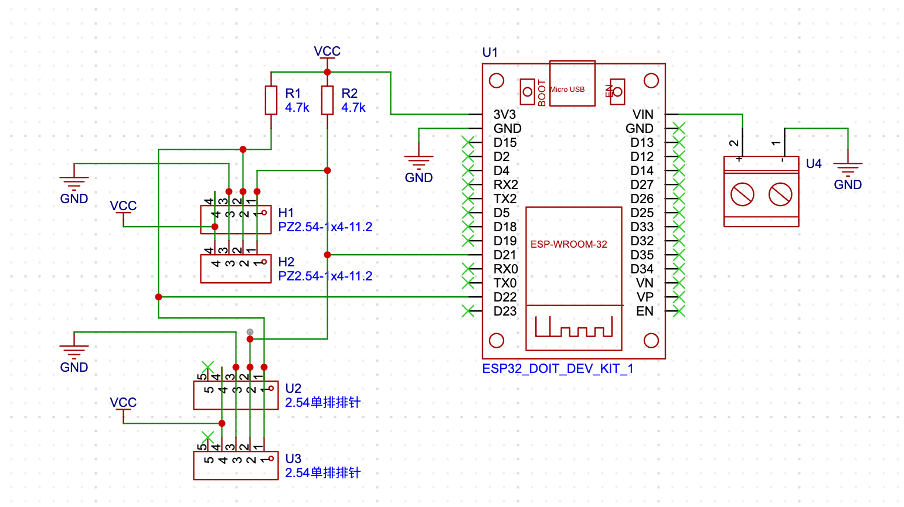
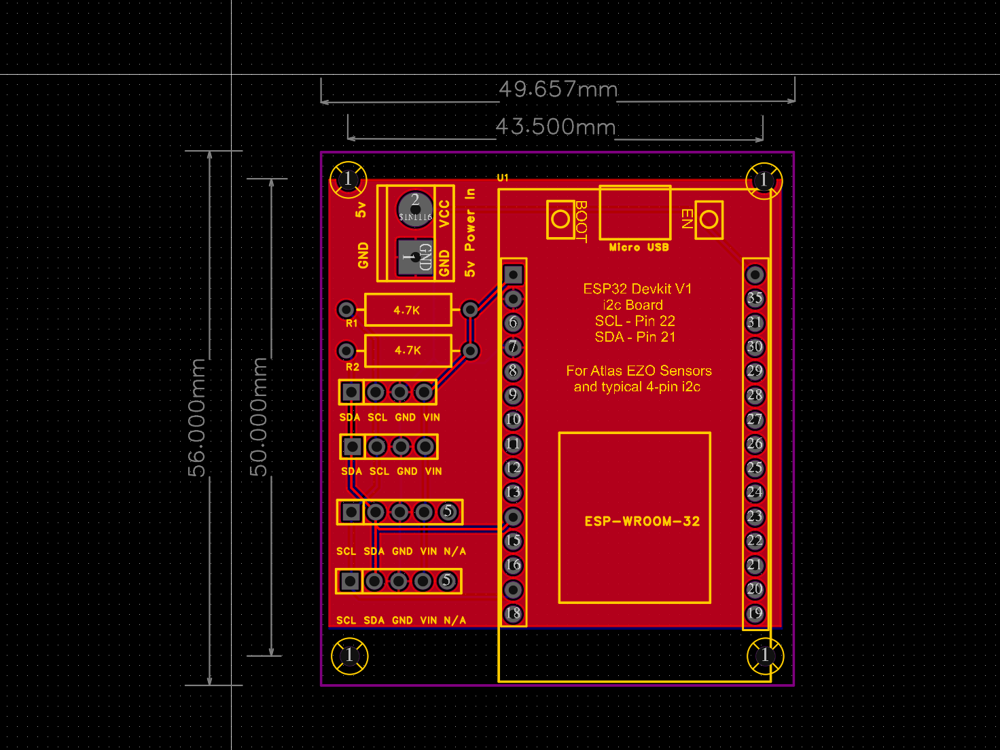
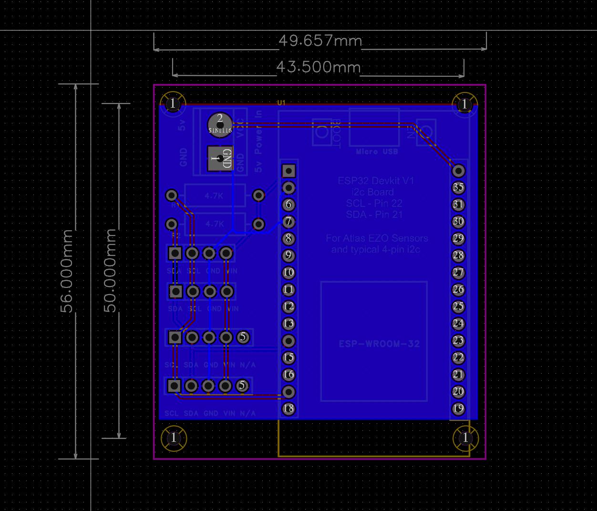
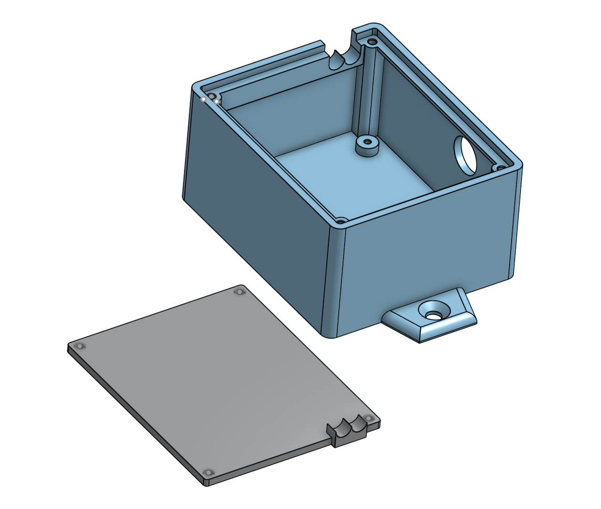
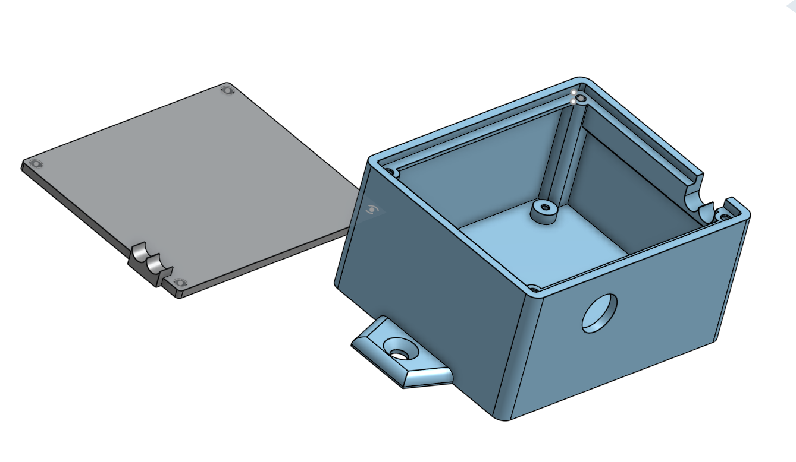

# EZO_ESPHome

ESPHome firmware for an ESP32-based environmental sensor box using two Atlas Scientific EZO sensors on a shared I2C bus. I'm using the two sensors shown, but see the "Using other EZO sensors" section below if you wish to use others.

- **EZO-CO2** — carbon dioxide (ppm)
- **EZO-HUM** — humidity, temperature, and dew point

Readings are published over WiFi to an MQTT broker. Built for monitoring a mushroom grow operation, with data flowing into Node-RED, InfluxDB, and Grafana, but nothing here depends on that stack — any MQTT consumer works.

Tested on **ESPHome 2026.1.4**.

---

## Why a custom component?

ESPHome's built-in `ezo` platform handles single-value EZO sensors (CO2, pH, EC, etc.), but the EZO-HUM returns several values in one comma-separated string (for example `24.04,19.18,Dew,-1.76`). The `ezo_hum` component in `local_components/` reads that string and splits it into separate humidity, temperature, and dew point sensors.

The EZO-CO2 is read with a raw I2C lambda in the YAML rather than the built-in `ezo` platform. This version waits a full 1000 ms after each read command (the EZO-CO2 needs about 900 ms to complete a measurement) and checks the sensor's status byte before parsing, logging a distinct message for each result:

| Status byte | Meaning |
|---|---|
| 1 | Success |
| 2 | Syntax error |
| 254 | Still processing |
| 255 | No data |

---

## Hardware

### Parts

| Part | Qty | Notes |
|---|---|---|
| ESP32 DevKit v1, 30-pin (`esp32doit-devkit-v1`) | 1 | Plugs into the carrier PCB |
| Atlas Scientific EZO-CO2 | 1 | I2C address `0x69` |
| Atlas Scientific EZO-HUM | 1 | I2C address `0x6F` |
| 4.7 kΩ resistor, through-hole | 2 | I2C pull-ups (R1, R2) |
| 2-position screw terminal | 1 | 5 V power input |
| Carrier PCB | 1 | See below |
| 3D-printed box and lid | 1 | See below |

I2C wiring: **SDA = GPIO21**, **SCL = GPIO22**

> **Note:** Atlas EZO circuits ship in UART mode. Each one must be switched to I2C mode before it will show up on the bus. See the Atlas Scientific datasheet for your sensor.

### Carrier PCB

A simple carrier board for the ESP32 DevKit v1 with a shared I2C bus for EZO sensors or other I2C modules.

- **Power:** 5 V in through the screw terminal, feeding the DevKit's VIN pin
- **Sensor power:** 3.3 V from the DevKit's 3V3 pin (the header pin is labeled **VIN** on the silkscreen, but it carries 3.3 V)
- **Pull-ups:** 4.7 kΩ on SDA and SCL to 3.3 V
- **Sensor headers:** four headers, all wired in parallel to the same bus
  - Two **4-pin** headers: SDA, SCL, GND, 3.3 V (matches common 4-pin I2C modules)
  - Two **5-pin** headers: SCL, SDA, GND, 3.3 V, N/A
> The 4-pin and 5-pin headers have SDA and SCL in **opposite order**. Check the silkscreen before connecting a sensor.

| Schematic | PCB top | PCB bottom |
|---|---|---|
|  |  |  |

**Ordering:** the Gerber and drill files in [`hardware/`](hardware/) were exported from EasyEDA. Zip them together and upload the zip to a PCB fabricator (JLCPCB, PCBWay, etc.). See [`hardware/How-to-order-PCB.txt`](hardware/How-to-order-PCB.txt).

### Enclosure

A 3D-printed box and lid sized for the carrier PCB. STL files are in [`enclosure/`](enclosure/):

- `EZO_ESP32DevKit-Box.stl`
- `EZO_ESP32DevKit-Lid.stl`
  Printed in **PETG**. The PCB and the lid both mount with **M2.5 screws**.

| Left | Right |
|---|---|
|  |  |
---

## Repository layout

```
EZO_ESPHome/
├── ezo32-box.yaml           ESPHome config (one file for every box)
├── secrets.yaml.example     Template for your credentials
├── local_components/
│   └── ezo_hum/             Custom EZO-HUM component
├── hardware/                PCB schematic, Gerbers, BOM
└── enclosure/               3D-print files
```

---

## Setup

1. Copy `ezo32-box.yaml` and the whole `local_components/` folder into your ESPHome config directory. The folder must sit next to the YAML.
2. Copy `secrets.yaml.example` to `secrets.yaml` and fill in your own values. (If you already have a `secrets.yaml`, just add any missing keys.)
3. Edit the three substitutions at the top of the YAML:
   ```yaml
   substitutions:
     devicename: ezo32-box1
     static_ip: 192.168.1.50
     gateway: 192.168.1.1
   ```
4. Compile and flash:
   ```bash
   esphome run ezo32-box.yaml
   ```
   For each additional box, save a copy of the YAML with a new name (e.g. `ezo32-box2.yaml`) and change only the substitutions.

---

## MQTT topics

All topics start with the device name. ESPHome builds sensor topics from each sensor's name, so confirm the exact names on your broker (for example with `mosquitto_sub -v -t '<devicename>/#'`).

**Sensor readings** (every 30 s)

```
<devicename>/sensor/ezo-co2/state
<devicename>/sensor/ezo_humidity/state
<devicename>/sensor/ezo_temperature/state
<devicename>/sensor/ezo_dew_point/state
```

**Diagnostics**

| Topic | Content |
|---|---|
| `<devicename>/logs/boot` | Published once at boot |
| `<devicename>/logs/boot_heap` | Free heap at boot |
| `<devicename>/logs/boot_reset` | Reason for the last reset (power on, brownout, watchdog, etc.) |
| `<devicename>/logs/heap` | Free heap, every 10 minutes |
| `<devicename>/logs/watchdog` | Published just before a restart if MQTT has been disconnected |

---

## Command channel

You can send any EZO command to either sensor over MQTT without reflashing. The sensor's reply is published to the matching `resp` topic.

| Sensor | Send command to | Reply appears on |
|---|---|---|
| EZO-CO2 | `<devicename>/sensor/ezo-co2/cmd` | `<devicename>/sensor/ezo-co2/resp` |
| EZO-HUM | `<devicename>/sensor/ezo-hum/cmd` | `<devicename>/sensor/ezo-hum/resp` |

Example — ask the CO2 sensor for its device info:

```bash
# Terminal 1: watch for the reply
mosquitto_sub -h <broker-ip> -u <user> -P <password> -t 'ezo32-box1/sensor/ezo-co2/resp'

# Terminal 2: send the command
mosquitto_pub -h <broker-ip> -u <user> -P <password> -t 'ezo32-box1/sensor/ezo-co2/cmd' -m 'i'
```

`i` (device info) and `Status` work on both sensors. See the Atlas Scientific datasheets for the full command list, including calibration.

---

## Using other EZO sensors

This project can be adapted to other Atlas Scientific EZO circuits (pH, EC, DO, ORP, RTD, and others). All EZO circuits speak the same basic I2C protocol: send a command, wait for the sensor to process it, then read back a status byte followed by the reply text.

### Default I2C addresses

Each sensor on the bus needs its own address. Common defaults:

| Circuit | Default address |
|---|---|
| EZO-DO (dissolved oxygen) | `0x61` |
| EZO-ORP | `0x62` |
| EZO-pH | `0x63` |
| EZO-EC (conductivity) | `0x64` |
| EZO-RTD (temperature) | `0x66` |
| EZO-CO2 | `0x69` |
| EZO-HUM | `0x6F` |

Confirm against the datasheet for your circuit. If two circuits share an address, one can be changed with the `I2C,n` command (the circuit reboots at the new address). Setting `scan: true` under `i2c:` lists every address found in the boot log.

### Option 1 — ESPHome's built-in `ezo` platform (simplest)

For circuits that return a single value, ESPHome's built-in platform needs no custom code:

```yaml
sensor:
  - platform: ezo
    id: ph_ezo
    name: "EZO pH"
    address: 0x63
    unit_of_measurement: "pH"
    update_interval: 30s
```

This has not been tested alongside the `ezo_hum` component in this project.

### Option 2 — Copy the CO2 raw I2C pattern

The CO2 section of `ezo32-box.yaml` works as a template for any single-value circuit. Copy both the template sensor and its `interval:` block, then change:

1. The address (`const uint8_t addr = 0x69;`)
2. The delay after the `R` command — check the datasheet for the circuit's read time (1000 ms covers most)
3. The sensor `name`, `id`, and `unit_of_measurement`
4. The global variable that stores the last value (add a new one for each sensor)

Each read blocks the board for the length of its delay, so with several sensors on one bus, keep the total delay per cycle reasonable.

### Command channel

To send commands to a new circuit over MQTT, copy one of the `on_message` blocks under `mqtt:` and change its topic name and address. Commands such as `i`, `Status`, and calibration then work the same way as for the CO2 and HUM sensors.

### Circuits that return more than one value

Some circuits can report several values in one comma-separated reply, like the EZO-HUM does. For example, the EZO-EC can report conductivity, TDS, salinity, and specific gravity together. You have two choices:

- **Turn off the extra outputs** with the circuit's `O` (output) command so it returns one value. Then either option above works.
- **Parse the full reply** by adapting the `ezo_hum` component in `local_components/`. It already splits a comma-separated reply into separate sensors.

### Temperature compensation

pH, EC, and DO readings are temperature-dependent. These circuits accept a temperature value (the `T` command) to compensate. See the datasheet for your circuit.
## Configuration notes

- **`api: reboot_timeout: 0s`** — without Home Assistant connected, ESPHome reboots the board every 15 minutes unless this is set.
- **`power_save_mode: none`** — keeps OTA updates and the API reliable.
- **Watchdog** — every 10 minutes the board checks its MQTT connection and restarts if disconnected. Useful for remote installs where nobody is on-site to power-cycle it.
- **Fallback hotspot** — if the board can't join WiFi, it starts its own access point named `<devicename> Fallback Hotspot`.
- **`local_components/`** — ESPHome deprecated the old `custom_components/` folder name, so this repo uses `local_components/`.
